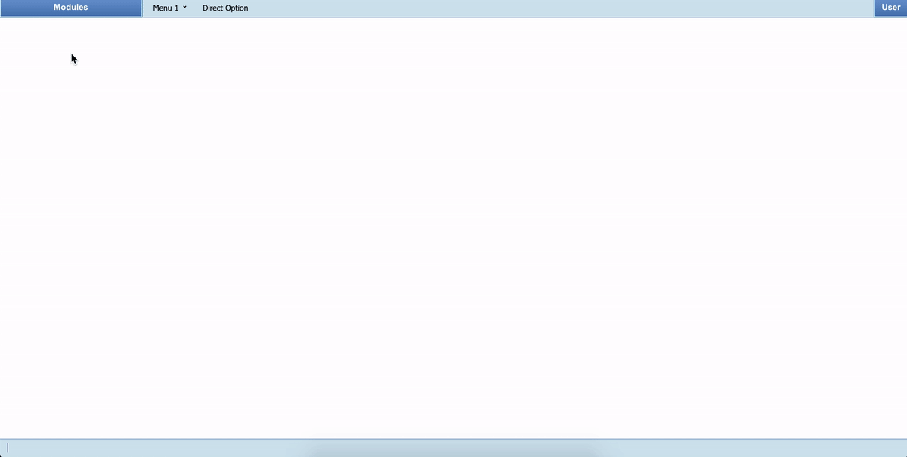

# react2desktop

> Desktop-like web environment for ReactJS

[](https://www.npmjs.com/package/react2desktop) [](https://standardjs.com)




[Live Example](http://files.luizcardim.com.br/r2d/)

## Install

```bash
npm install --save react2desktop
```

## Usage

```jsx
import React from 'react'

import Desktop from 'react2desktop'
import 'react2desktop/dist/index.css'

// Here you import the elements you will put inside the windows
import { BlankPage } from './blank' 

const App = () => {

  // Passing the menu options
  let menu = [
    {

      name: 'Module Name 1', // Name of the first module
      icon: 'ri-focus-line',  // Icon of the first module
      items: [
        {
          name: 'Menu 1', items: [ // Name of the first menu of the first module
            { name: 'Option 1', icon: 'ri-window-fill', component: <BlankPage></BlankPage> }, // The options from the menu...
            { name: 'Option 2', icon: 'ri-window-fill', component: <BlankPage></BlankPage> },
          ]
        },
        {
          name: 'Menu 2', items: [ // Name of the second menu of the first module
            { name: 'Option 1', icon: 'ri-window-fill', component: <BlankPage></BlankPage> }, // The options from the menu...
            { name: 'Option 2', icon: 'ri-window-fill', component: <BlankPage></BlankPage> },
            { name: 'Option 3', icon: 'ri-window-fill', component: <BlankPage></BlankPage> },
          ]
        },
      ]
    },
    {

      name: 'Module Name 2', // Name of the second module
      icon: 'ri-book-open-fill', // Icon of the second module
      items: [
        {
          name: 'Menu 1', items: [
            { name: 'Option 1', icon: 'ri-window-fill', component: <BlankPage></BlankPage> },
            { name: 'Option 2', icon: 'ri-window-fill', component: <BlankPage></BlankPage> }
          ]
        },
        { name: 'Direct Option', icon: 'ri-window-fill', component: <BlankPage></BlankPage> }
      ]
    }
  ]

  // Options from the user menu (top-right)
  let user_menu = [
    {
      name: 'My Profile',
      component: <BlankPage></BlankPage>
    },
    {
      name: 'Logout',
      action: () => console.log('Logout...')
    },

  ]

  

  return <Desktop menu_options={menu} user_menu={user_menu} />
}

export default App
```

## Icons

This project uses the icons from [remixicon](https://remixicon.com/) library.

## The Inherited Props 

React2Desktop makes the window functions accessible to child components through props. (Look at the example > src > pages > example.jsx)

## API

### Menu
An array of objects describing the links for each module of the system.

#### Modules options

The 1st level of the menu array contain the description of the modules.

|Name|Description|Type|
|----|----|----|
|name*|The name of the option/module, it must be unique.|String|
|icon|The icon of the module.|String|
|items|The menu options of the module.|Array of objects (menu options)|

#### Module menu option
From 2nd level further the objects describe the options from the menus inside modules.

|Name|Description|Type|
|----|----|----|
|name*|The name of the option/window, it must be unique.|String|
|icon|The icon of the window.|String|
|Items|If this property is set, the button will act as a menu, ignoring the component property.|Array of objects (menu options)|
|component|The component that will be rendered inside window.|React Component|


### User menu
An array of objects describing the links for the top-right menu of the system.

|Name|Description|Type|
|----|----|----|
|name*|The name of the option/window, it must be unique.|String|
|action|If this property is set, the button will ignore the component property.|Function|
|component|The component that will be rendered inside window.|React Component|

## License

MIT © [luizhcardim](https://github.com/luizhcardim)
